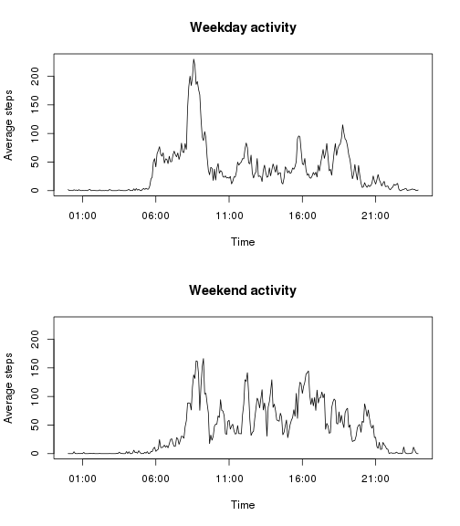

###Loading and preprocessing the data


First, let's **read** the data. Make sure you set your working directory appropriately so that the data is in the WD.


```r
activity<-read.csv("./activity.csv")
head(activity)
```

```
##   steps       date interval
## 1    NA 2012-10-01        0
## 2    NA 2012-10-01        5
## 3    NA 2012-10-01       10
## 4    NA 2012-10-01       15
## 5    NA 2012-10-01       20
## 6    NA 2012-10-01       25
```

```r
summary(activity)
```

```
##      steps                date          interval     
##  Min.   :  0.00   2012-10-01:  288   Min.   :   0.0  
##  1st Qu.:  0.00   2012-10-02:  288   1st Qu.: 588.8  
##  Median :  0.00   2012-10-03:  288   Median :1177.5  
##  Mean   : 37.38   2012-10-04:  288   Mean   :1177.5  
##  3rd Qu.: 12.00   2012-10-05:  288   3rd Qu.:1766.2  
##  Max.   :806.00   2012-10-06:  288   Max.   :2355.0  
##  NA's   :2304     (Other)   :15840
```

We can see that there are three variables: number of steps, date, and interval (identifies the 5-minute interval of the day).   
*steps* has many missing values. 

Let's **split** the data by date. This will create a list of 61 dataframes, since the data was obtained during 61 days.


```r
bydate<-split(activity,activity$date)
```

###What is mean total number of steps taken per day?

Now we will create a new dataset that stores the total number of steps taken on each day.


```r
days<-unique(activity$date)
datesteps<-data.frame(days,rep(0,length(days)))
names(datesteps)<-c("date","steps")

for(i in 1:length(days))
    datesteps[i,2]<-sum(bydate[[i]][,1])
head(datesteps)
```

```
##         date steps
## 1 2012-10-01    NA
## 2 2012-10-02   126
## 3 2012-10-03 11352
## 4 2012-10-04 12116
## 5 2012-10-05 13294
## 6 2012-10-06 15420
```

There are days with missing values. Should we ignore NAs? Well, looking at each one of the days where there are missing values, we can see that there is no data stored in *any* 5-minute interval, so eliminating NAs would only cause that the total number of steps for the day is 0.  
I think it is better to leave these as NAs.

Let's plot a **histogram** for the number of steps taken per day.


```r
par(mfrow=c(1,1))
hist(datesteps$steps,main="Total number of steps per day",xlab="Steps per day")
```

 

**Mean and median steps per day**

Let's calculate the mean and median number of steps taken per day.

```r
mean(datesteps$steps,na.rm=TRUE)
```

```
## [1] 10766.19
```

```r
median(datesteps$steps,na.rm=TRUE)
```

```
## [1] 10765
```

###What is the average daily activity pattern?

For each 5 minute interval, we will compute the mean number of steps taken accross all days.


```r
intervals<-unique(activity$interval)
intMean<-rep(0,length(intervals))
for(i in 1:length(intervals))
    intMean[i]<-mean(activity$steps[activity$interval==intervals[i]],na.rm=TRUE)
head(data.frame(intervals,intMean))
```

```
##   intervals   intMean
## 1         0 1.7169811
## 2         5 0.3396226
## 3        10 0.1320755
## 4        15 0.1509434
## 5        20 0.0754717
## 6        25 2.0943396
```

This plot shows the average activity across the day:


```r
intTime<-seq(ISOdatetime(2015,1,1,0,0,0), ISOdatetime(2015,1,1,23,55,0), by=(60*5))
par(mfrow=c(1,1))
plot(intTime,intMean,type="l",xlab="Time",ylab="Average steps",main="Average daily pattern")
```

 

**Which 5-minute interval, on average across all the days in the dataset, contains the maximum number of steps?**


```r
intervals[intMean==max(intMean)]
```

```
## [1] 835
```

So, the interval where the average number of steps is maximum is *835*, which means from 8:35 to 8:40 am.


###Imputing missing values

How many missing values are there in the dataset?


```r
sum(is.na(activity$steps))
```

```
## [1] 2304
```

Since all the NAs correspond to 8 full days where the data is missing, we can't fill them in with the mean or median for that day.

So, let's replace NAs with the mean for that interval. This will be stored in a new dataset, called *activityNoNAs*.


```r
activityNoNAs<-activity
for (i in 1:length(activity$steps))
    if (is.na(activityNoNAs$steps[i]))
        {inti<-activityNoNAs$interval[i]
        meani<-intMean[intervals==inti]
        activityNoNAs$steps[i]<-meani}
head(activityNoNAs)
```

```
##       steps       date interval
## 1 1.7169811 2012-10-01        0
## 2 0.3396226 2012-10-01        5
## 3 0.1320755 2012-10-01       10
## 4 0.1509434 2012-10-01       15
## 5 0.0754717 2012-10-01       20
## 6 2.0943396 2012-10-01       25
```

We can check that all the missing values have now been replaced by the mean of the interval.

First of all, there are no more NAs:


```r
sum(is.na(activityNoNAs$steps))
```

```
## [1] 0
```

And also, if we find the days when there were missing values, we can see that they have been replaced by the same data, which is what we wanted.


```r
NAdays<-unique(activity$date[is.na(activity$steps)]) #dates with NAs
head(activityNoNAs[activityNoNAs$date==NAdays[1],]) #first date
```

```
##       steps       date interval
## 1 1.7169811 2012-10-01        0
## 2 0.3396226 2012-10-01        5
## 3 0.1320755 2012-10-01       10
## 4 0.1509434 2012-10-01       15
## 5 0.0754717 2012-10-01       20
## 6 2.0943396 2012-10-01       25
```

```r
head(activityNoNAs[activityNoNAs$date==NAdays[2],]) #second date
```

```
##          steps       date interval
## 2017 1.7169811 2012-10-08        0
## 2018 0.3396226 2012-10-08        5
## 2019 0.1320755 2012-10-08       10
## 2020 0.1509434 2012-10-08       15
## 2021 0.0754717 2012-10-08       20
## 2022 2.0943396 2012-10-08       25
```

```r
head(activityNoNAs[activityNoNAs$date==NAdays[8],]) #eigth date
```

```
##           steps       date interval
## 17281 1.7169811 2012-11-30        0
## 17282 0.3396226 2012-11-30        5
## 17283 0.1320755 2012-11-30       10
## 17284 0.1509434 2012-11-30       15
## 17285 0.0754717 2012-11-30       20
## 17286 2.0943396 2012-11-30       25
```

**Histogram of total number of steps per day**


```r
bydate2<-split(activityNoNAs,activityNoNAs$date)
datesteps2<-data.frame(days,rep(0,length(days)))
names(datesteps2)<-c("date","steps")

for(i in 1:length(days))
    datesteps2[i,2]<-sum(bydate2[[i]][,1])
head(datesteps2)
```

```
##         date    steps
## 1 2012-10-01 10766.19
## 2 2012-10-02   126.00
## 3 2012-10-03 11352.00
## 4 2012-10-04 12116.00
## 5 2012-10-05 13294.00
## 6 2012-10-06 15420.00
```

```r
hist(datesteps2$steps,main="Total number of steps per day (no NAs)",xlab="Steps per day")
```

 

Let's compare both histograms: the original data and the new data with no NAs.


```r
par(mfrow=c(1,2))
hist(datesteps$steps,main="Original data",xlab="Steps per day",ylim=c(0,40))
hist(datesteps2$steps,main="Modified data (no NAs)",xlab="Steps per day",ylim=c(0,40))
```

 

We can see that since the NAs were replaced by the mean for each interval, there has been a significant change in the **middle** class (10000-15000 steps per day). 

**Comparing means and medians**


```r
m<-matrix(c(mean(datesteps$steps,na.rm=TRUE),median(datesteps$steps,na.rm=TRUE),mean(datesteps2$steps),median(datesteps2$steps)),2,2)
colnames(m)<-c("Original","Transformed")
rownames(m)<-c("mean","median")
m
```

```
##        Original Transformed
## mean   10766.19    10766.19
## median 10765.00    10766.19
```

In conclusion, when replacing NAs with the mean for each interval, the **mean** number of steps per day stays the same. The **median**, however, has changed.  
I believe that since there were 8 out of 61 days where data was missing, there are now 8 days in which the total number of steps is the same, and since that number is in the middle (because of the symmetrical distribution of the data), the median coincides with the mean. Perhaps if only 1 or 2 days had been missing data this would not have happen.


###Are there differences in activity patterns between weekdays and weekends?

We will create a new factor variable called *daytype*, with two levels: *Weekday* or *Weekend* and add it to our modified dataframe.


```r
daytype<-weekdays(strptime(activity$date,"%Y-%m-%d"))
for (i in 1:length(daytype))
{if (daytype[i]=="Saturday"|daytype[i]=="Sunday") {daytype[i]<-"Weekend"}
else {daytype[i]<-"Weekday"}
}
activityNoNAs<-data.frame(activityNoNAs,daytype)
head(activityNoNAs)
```

```
##       steps       date interval daytype
## 1 1.7169811 2012-10-01        0 Weekday
## 2 0.3396226 2012-10-01        5 Weekday
## 3 0.1320755 2012-10-01       10 Weekday
## 4 0.1509434 2012-10-01       15 Weekday
## 5 0.0754717 2012-10-01       20 Weekday
## 6 2.0943396 2012-10-01       25 Weekday
```

Now, to see if the activity pattern differs on Weekdays or Weekends, let's create a panel plot, using the modified data (no NAs).

First, this creates the dataframe *weekdaysummary* with the mean steps taken per interval over weekdays.


```r
weekdaydata<-activityNoNAs[activityNoNAs$daytype=="Weekday",]
intMeanWD<-rep(0,length(intervals))
for(i in 1:length(intervals))
    intMeanWD[i]<-mean(weekdaydata$steps[activityNoNAs$interval==intervals[i]],na.rm=TRUE)
weekdaysummary<-data.frame(intervals,intMeanWD,daytype=rep("Weekday",length(intervals)))
head(weekdaysummary)
```

```
##   intervals  intMeanWD daytype
## 1         0 2.25115304 Weekday
## 2         5 0.44528302 Weekday
## 3        10 0.17316562 Weekday
## 4        15 0.19790356 Weekday
## 5        20 0.09895178 Weekday
## 6        25 1.59035639 Weekday
```

And this creates the dataframe *weekendsummary* with the mean steps taken per interval over weekends.


```r
weekenddata<-activityNoNAs[activityNoNAs$daytype=="Weekend",]
intMeanWE<-rep(0,length(intervals))
for(i in 1:length(intervals))
    intMeanWE[i]<-mean(weekenddata$steps[activityNoNAs$interval==intervals[i]],na.rm=TRUE)
weekendsummary<-data.frame(intervals,intMeanWE,daytype=rep("Weekend",length(intervals)))
head(weekendsummary)
```

```
##   intervals   intMeanWE daytype
## 1         0 0.214622642 Weekend
## 2         5 0.042452830 Weekend
## 3        10 0.016509434 Weekend
## 4        15 0.018867925 Weekend
## 5        20 0.009433962 Weekend
## 6        25 3.511792453 Weekend
```

Putting everything together:


```r
par(mfrow=c(2,1))
plot(intTime,intMeanWD,type="l",ylim=c(0,230),main="Weekday activity",xlab="Time",ylab="Average steps")
plot(intTime,intMeanWE,type="l",ylim=c(0,230),main="Weekend activity",xlab="Time",ylab="Average steps")
```

 

This shows that there is a clear peak during weekdays in the morning (perhaps this person is going to work, or doing physical activity before work), but on weekends there is a more even spread of activity from mid morning till late afternoon.   


